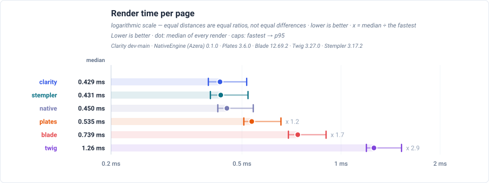

# Clarity Template Engine


> **A fast, secure, and expressive PHP template engine** – Clarity compiles `.clarity.html` templates into cached PHP classes for maximum performance while maintaining a sandboxed, secure execution environment.

---

## Features

- **Compiled & Cached** – Templates compile to PHP classes and leverage OPcache for blazing-fast rendering
- **Secure Sandbox** – No arbitrary PHP execution; templates are strictly sandboxed with controlled access
- **Expressive Syntax** – Clean, readable template syntax inspired by modern template engines
- **Template Inheritance** – Reusable layouts with `extends` and `blocks` for DRY template architecture
- **Macros** – Define reusable template fragments with parameters and call them inline
- **Extensible** — Custom filters, functions, inline filters, block directives, and loader plugins
- **Modules** – Bundle filters, functions, and directives into self-registering plug-ins
- **Auto-escaping** – Built-in XSS protection with context-aware automatic HTML/JS/CSS escaping
- **Unicode Support** – Full multibyte string handling with transparent normalization
- **Zero Dependencies** – Standalone engine with no external dependencies beyond PHP 8.1+

---

## Installation

```bash
composer require sailantis/clarity-engine
```

**Requirements:** PHP 8.1 or higher

---

## Quick Start

### Basic Setup

```php
<?php
require_once 'vendor/autoload.php';

use Clarity\ClarityEngine;

// Initialize the engine
$engine = new ClarityEngine([
    'viewPath'   => __DIR__ . '/templates',
    'namespaces' => [
        'admin'  => __DIR__ . '/templates/admin',
        'emails' => __DIR__ . '/templates/emails',
    ],
]);

// Render a template
echo $engine->render('welcome', [
    'title' => 'Welcome to Clarity',
    'user' => ['name' => 'Developer']
]);
```

### Your First Template

**templates/welcome.clarity.html:**

```twig
<!DOCTYPE html>
<html>
  <head>
    <title>{{ title }}</title>
  </head>
  <body>
    <h1>Hello, {{ user:name }}!</h1>
    <p>The current time is {{ "now" |> date("H:i:s") }}</p>
  </body>
</html>
```

That's it! Clarity automatically compiles and caches your template.

---

## Documentation

### For Template Authors

Start here if you're writing templates:

- **[Getting Started](docs/00-getting-started.md)** – Installation, setup, and your first template
- **[Template Syntax](docs/01-template-syntax.md)** – Variables, directives, operators, and control flow
- **[Filters & Functions](docs/02-filters-and-functions.md)** – Transform data with built-in and custom filters
- **[Layout Inheritance](docs/03-layout-inheritance.md)** – Reusable layouts with extends and blocks

### For Developers

Integration and advanced topics:

- **[Advanced Topics](docs/04-advanced-topics.md)** – Namespaces, caching, auto-escaping, and Unicode
- **[Best Practices](docs/05-best-practices.md)** – Organization, security, performance, and testing
- **[Troubleshooting](docs/06-troubleshooting.md)** – Common errors and debugging techniques

### Reference

- **[API Documentation](docs/api/)** – Auto-generated API reference for all classes
- **[Examples](docs/examples/)** – Runnable template examples demonstrating features
- **[Guide Index](docs/README.md)** – Complete documentation index

---

### Output & Variables

```twig
{{ expression }}                 {# Output with auto-escaping #}
{{ expression | raw }}           {# Output raw HTML (no escaping) #}
{{ expression |> raw }}          {# Same — both | and |> are filter pipes #}
{{ user:name }}                  {# Array key (static) #}
{{ user.name }}                  {# Object property (static) #}
{{ items[0] }}                   {# Array index #}
{{ firstName ~ ' ' ~ lastName }} {# String concatenation #}
```

### Control Flow

```twig
.........


  {{ item:name }}


               {# Loop with key variable #}
  {{ key }}: {{ value }}


{{ i }}          {# Range: 1 to 10 (inclusive) #}
{{ i }}         {# Range: 1 to 9 (exclusive) #}
{{ i }} {# With step #}


```

### Macros

```twig

<div class="card"><h3>{{ title }}</h3><p>{{ body }}</p></div>




```

### Filters

```twig
{{ text | upper }}
{{ text |> upper }}                          {# both | and |> are equivalent #}
{{ price | number(2) }}
{{ timestamp | date('Y-m-d H:i') }}
{{ "Hello, %s!" | sprintf(user.name) }}
{{ tags | join(', ') }}
{{ users | map(u => u.name) | join(', ') }}  {# Lambda expression #}
{{ items | filter(i => i.active) | length }}
{{ title | slug }}                           {# URL-friendly slug #}
{{ html | striptags }}                       {# Strip HTML tags #}
```

Common filters: `upper`, `lower`, `trim`, `length`, `number`, `date`, `sprintf`, `json`, `join`, `split`, `slug`, `map`, `filter`, `reduce`, `default`, `empty`, `striptags`, `escape`, `raw`

**[See all filters and detailed syntax →](docs/02-filters-and-functions.md)**

### Template Inheritance

```twig
{# layouts/base.clarity.html #}
<!DOCTYPE html>
<html>
  <head>
    <title>Default Title</title>
  </head>
  <body>
    
  </body>
</html>

{# pages/home.clarity.html #}

Home Page

  <h1>Welcome!</h1>

```

### Includes

```twig
                {# Static include #}
{{ include("widgets/card", { title: "Hi" }) }} {# Dynamic include with context #}
```

**[Full syntax reference →](docs/01-template-syntax.md)**

---

## Configuration

Configure the engine with these methods:

```php
// Initialize with config array
$engine = new ClarityEngine([
    'viewPath' => __DIR__ . '/templates',
    'cachePath' => __DIR__ . '/cache',
]);

// Or configure via setters
$engine = ClarityEngine::create()
    ->setViewPath(__DIR__ . '/templates')
    ->setCachePath(__DIR__ . '/cache'); // Default: sys temp + /clarity_cache

// Additional configuration
$engine->setExtension('.tpl.html');           // Default: .clarity.html

// Register named namespaces (convenience method)
$engine->addNamespace('admin',  __DIR__ . '/templates/admin');
$engine->addNamespace('emails', __DIR__ . '/templates/emails');
// Templates with a namespace prefix: 
// Unprefixed templates still resolve via the base viewPath.

// Namespaces can also be passed in the constructor:
// new ClarityEngine(['namespaces' => ['admin' => __DIR__ . '/templates/admin']]);

// For advanced multi-source setups, set a loader directly:
$engine->setLoader(new \Clarity\Template\DomainRouterLoader(
    ['admin' => new \Clarity\Template\FileLoader('/path/to/admin/templates')],
    fallback: new \Clarity\Template\FileLoader('/path/to/templates'),
));
$engine->setDebugMode(true);                  // Runtime safety checks (dev only)

// Add custom filter
$engine->addFilter('currency', fn($v) => '€ ' . number_format($v, 2));
// Clear compiled templates
$engine->flushCache();

// Modules: bundle filters, functions, and directives
$engine->use(new \Clarity\Localization\IntlFormatModule(['locale' => 'en_US']));
$engine->use(new \Clarity\Localization\TranslationModule([
    'locale'            => 'en_US',
    'translations_path' => __DIR__ . '/locales',
]));
```

**[Configuration guide →](docs/00-getting-started.md#configuration)**

---

## Security

Clarity provides a secure sandbox environment:

- **No arbitrary PHP execution** – Templates cannot call PHP functions or access global state
- **Auto-escaping by default** – All output is HTML-escaped to prevent XSS attacks
- **Compile-time validation** – Syntax errors caught during compilation, not at runtime
- **Object safety** – Objects are converted to their public properties, preventing method calls from templates (`DateTimeInterface` becomes an ISO-8601 string; `toArray()` / `JsonSerializable` can supply a custom array)
- **Controlled lambdas** – Lambda expressions can only use registered filters

**[Security best practices →](docs/05-best-practices.md#security)**

---

## Performance

Clarity is designed for speed. Templates compile to native PHP classes and leverage OPcache for optimal performance:

- **Compiled templates** – One-time compilation to PHP, then served from OPcache
- **Auto-invalidation** – Cache automatically refreshed when templates change
- **Zero runtime overhead** – Inheritance resolved at compile time
- **Minimal memory footprint** – Efficient compilation with predictable memory usage

### Benchmark Results

Clarity is measured against the other mainstream PHP template engines rendering
one identical page. The chart and table below are generated from the benchmark
run's own JSON — the figures are not transcribed, so they cannot drift from the
data they came from.

<!-- view-engine:begin -->

Clarity is measured against other PHP template engines rendering the same page, on the same machine and PHP build. The chart and the table below are generated from the run's own JSON.



Rows are ordered by median, fastest first. Two engines sitting next to each other at the top of the table are not thereby ranked: the harness rotates engine order between runs, and a difference well under one percent is narrower than the run-to-run drift of engines whose code did not change, so it is a tie rather than a win.

| Engine   | First render (ms) | Mean (ms) | Median (ms) | Min (ms) | p95 (ms) | Trimmed mean (ms) | Peak memory (MB) |
| -------- | ----------------: | --------: | ----------: | -------: | -------: | ----------------: | ---------------: |
| Clarity  |             9.948 |     0.444 |       0.429 |    0.395 |    0.517 |             0.444 |              1.6 |
| Stempler |            23.730 |     0.447 |       0.431 |    0.401 |    0.522 |             0.446 |              1.7 |
| Native   |             0.662 |     0.466 |       0.450 |    0.422 |    0.541 |             0.466 |              1.5 |
| Plates   |             2.500 |     0.557 |       0.535 |    0.506 |    0.657 |             0.557 |              1.5 |
| Blade    |            34.432 |     0.765 |       0.739 |    0.692 |    0.901 |             0.765 |              2.0 |
| Twig     |            38.315 |     1.301 |       1.259 |    1.194 |    1.527 |             1.301 |              1.8 |

**Environment** — PHP 8.3.33 · Linux 6.8.0-139-generic · SAPI cli · OPcache (`opcache.enable_cli`): yes

**Budget** — 10,000 renders × 30 runs, 200 items per render

**Engines** — Clarity dev-main · NativeEngine (Azera) 0.1.0 · Plates 3.6.0 · Blade 12.69.2 · Twig 3.27.0 · Stempler 3.17.2

_Measured 2026-09-22T17:44:57+00:00_

Full report — every chart, including the first-render compile cost and per-render memory: <https://sailantis.github.io/azera-competition/benchmarks/view-engine.html>

<!-- view-engine:end -->

**[Performance optimization guide →](docs/05-best-practices.md#performance)**

---

## Contributing

Contributions are welcome! Please feel free to submit a Pull Request.

### Running Tests

```bash
composer install
composer test
```

Or run PHPUnit directly:

```bash
php vendor/bin/phpunit
```

---

## License

This project is licensed under the MIT License - see the [LICENSE](LICENSE) file for details.

---

## Links

- **[Documentation](docs/README.md)** – Complete guide index
- **[Examples](docs/examples/)** – Runnable example templates
- **[API Reference](docs/api/)** – Auto-generated API documentation
- **[GitHub Issues](https://github.com/clarity/engine/issues)** – Report bugs or request features

---

Built with ❤️ for developers who value security and performance
