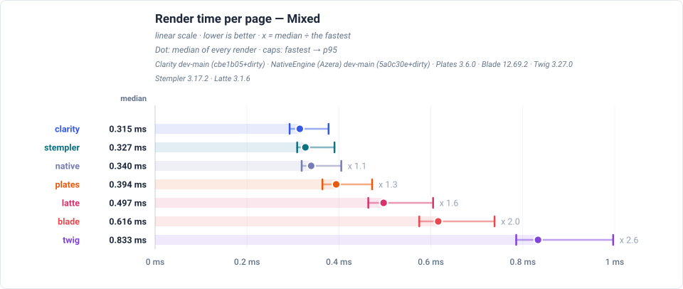
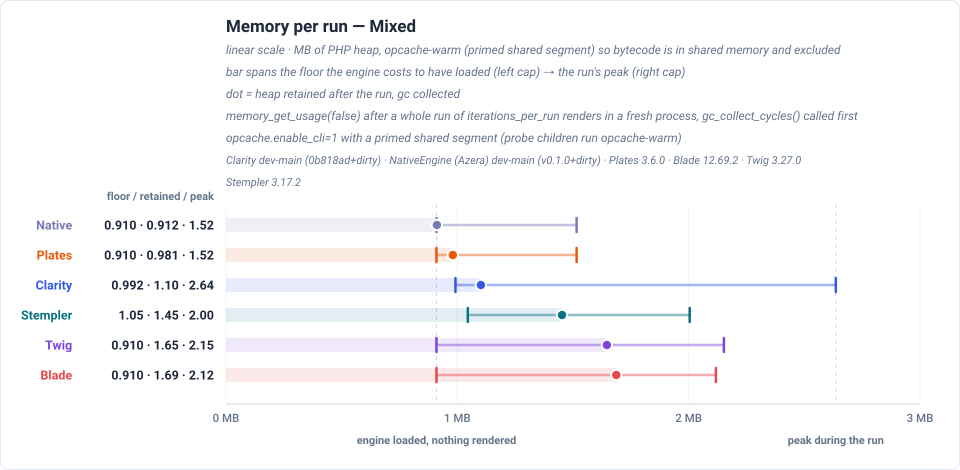

> **A fast, secure, and expressive PHP template engine** – Start with a restricted policy, then grant templates only the access they need.

---

## Features

- **Compiled & Cached** – Templates compile to PHP classes and leverage OPcache for blazing-fast rendering
- **Secure Sandbox** – No arbitrary PHP execution by default; templates are strictly sandboxed with controlled access
- **Policy-Based Access** – Grant specific PHP features or enable full PHP access for trusted templates
- **Expressive Syntax** – Clean, readable template syntax inspired by modern template engines
- **Twig-Style Tests** – `in`, `is defined`, `starts with`, `matches`, `divisible by`, and more, with absence-tolerant `defined`/`null`/`empty`
- **Whitespace Control** – `` trims whitespace around a tag
- **Loop Fallbacks** – ` …  … ` renders the `else` branch when the sequence is empty
- **Template Inheritance** – Reusable layouts with `extends` and `blocks` for DRY template architecture
- **Macros** – Define reusable template fragments with parameters and call them inline
- **Extensible** — Custom filters, functions, inline filters, block directives, and loader plugins
- **Modules** – Bundle filters, functions, and directives into self-registering plug-ins
- **Auto-escaping** – Built-in XSS protection with context-aware automatic HTML/JS/CSS escaping
- **Unicode Support** – Full multibyte string handling with transparent normalization
- **Minimal Dependencies** – Requires PHP 8.2+ and the `mbstring` extension; no other external dependencies

---

## Installation

```bash
composer require sailantis/clarity-engine
```

**Requirements:** PHP 8.2 or higher and the `mbstring` extension

---

## Quick Start

### Basic Setup

```php
<?php
require_once 'vendor/autoload.php';

use Clarity\ClarityEngine;

// Initialize the engine
$engine = new ClarityEngine([
    'viewPath'   => __DIR__ . '/views',
]);

// Render a template. The second argument is the template's scope.
echo $engine->render('welcome', [
    'title' => 'Welcome to Clarity',
    'user'  => (object) ['name' => 'Developer'],   // object -> {{ user.name }}
    // 'user' => ['name' => 'Developer'],          // array  -> {{ user:name }}
]);
```

### Your First Template

**views/welcome.clarity.html:**

```twig
<!DOCTYPE html>
<html>
  <head>
    <title>{{ title }}</title>
  </head>
  <body>
    <h1>Hello, {{ user.name }}!</h1>
    <p>The current time is {{ "now" |> date("H:i:s") }}</p>
  </body>
</html>
```

That's it! Clarity automatically compiles and caches your template.

### What a Template May Reach

Every template compiles under a **policy**: a set of rules plus two
allowlists. The default is the most restrictive one, and the syntax is the same
in all of them — only what a template may _reach_ changes:

```twig
{# Always available #}
<h1>Hello, {{ user.name }}!</h1>       {# object property #}
<p>{{ settings:tagline }}</p>          {# array key; {{ settings['tagline'] }} also works #}
{{ items[0] }}                         {# index #}
{{ $user->name }}                      {# property via the `$` sigil #}
{{ "now" |> date("H:i:s") }}           {# registered filters and functions #}
{{ $missing is defined }}              {# operator tests #}

{# Granted by a rule #}
{{ strtoupper(name) }}                 {# any PHP function #}
{{ 'ab' |> strtoupper }}               {# any function as a filter step #}
{{ $user->greet() }}                   {# methodCalls #}
                    {# rawPhp #}
{{ $_SERVER['HTTP_HOST'] }}            {# superglobals #}
{{ new DateTime("now") }}              {# newExpressions #}
{{ DateTime::ATOM }}                   {# staticCalls #}
```

```php
use Clarity\Engine\Policy;

$engine->setPolicy(Policy::restricted());    // the default
$engine->setPolicy(Policy::unrestricted());  // everything on
$engine->setPolicy(Policy::default()         // grant one thing, not all
    ->allowRule('methodCalls')
    ->allowFunctions('strtoupper', 'count'));
```

`Policy::unrestricted()` enables every rule and is equivalent to executing
arbitrary PHP. Individual rules expose narrower features — see
[the security model](docs/04-advanced-topics.md#security-model) and
[the policy reference](docs/09-policy-api.md).

---

## Documentation

### For Template Authors

Start here if you're writing templates:

- **[Getting Started](docs/00-getting-started.md)** – Installation, setup, and your first template
- **[Template Syntax](docs/01-template-syntax.md)** – Variables, directives, operators, and control flow
- **[Filters & Functions](docs/02-filters-and-functions.md)** – Transform data with built-in and custom filters
- **[Layout Inheritance](docs/03-layout-inheritance.md)** – Reusable layouts with extends and blocks

### For Developers

Integration and advanced topics:

- **[Advanced Topics](docs/04-advanced-topics.md)** – Namespaces, caching, auto-escaping, and Unicode
- **[Best Practices](docs/05-best-practices.md)** – Organization, security, performance, and testing
- **[Troubleshooting](docs/06-troubleshooting.md)** – Common errors and debugging techniques

### Reference

- **[API Documentation](docs/api/)** – Auto-generated API reference for all classes
- **[Examples](docs/examples/)** – Runnable template examples demonstrating features
- **[Guide Index](docs/README.md)** – Complete documentation index

---

### Output & Variables

```twig
{{ expression }}                 {# Output with auto-escaping #}
{{ expression | raw }}           {# Output raw HTML (no escaping) #}
{{ expression |> raw }}          {# Same — both | and |> are filter pipes #}
{{ user:name }}                  {# Array key #}
{{ user.name }}                  {# Object property #}
{{ items[0] }}                   {# Array index #}
{{ user[var] }}                  {# Dynamic array key #}
{{ user{var} }}                  {# Dynamic property #}
{{ firstName ~ ' ' ~ lastName }} {# String concatenation #}
```

### Control Flow

```twig
.........


  {{ item:name }}


               {# Loop with key variable #}
  {{ key }}: {{ value }}


{{ i }}          {# Range: 1 to 10 (inclusive) #}
{{ i }}         {# Range: 1 to 9 (exclusive) #}
{{ i }} {# With step #}


```

### Macros

```twig

<div class="card"><h3>{{ title }}</h3><p>{{ body }}</p></div>




```

### Filters

```twig
{{ text | upper }}
{{ text |> upper }}                          {# both | and |> are equivalent #}
{{ price | number(2) }}
{{ timestamp | date('Y-m-d H:i') }}
{{ "Hello, %s!" | sprintf(user.name) }}
{{ tags | join(', ') }}
{{ users | map(u => u.name) | join(', ') }}  {# Lambda expression #}
{{ items | filter(i => i.active) | length }}
{{ title | slug }}                           {# URL-friendly slug #}
{{ html | striptags }}                       {# Strip HTML tags #}
```

Common filters: `upper`, `lower`, `trim`, `length`, `number`, `date`, `sprintf`, `json`, `join`, `split`, `slug`, `map`, `filter`, `reduce`, `default`, `empty`, `striptags`, `escape`, `raw`

**[See all filters and detailed syntax →](docs/02-filters-and-functions.md)**

### Template Inheritance

```twig
{# layouts/base.clarity.html #}
<!DOCTYPE html>
<html>
  <head>
    <title>Default Title</title>
  </head>
  <body>
    
  </body>
</html>

{# pages/home.clarity.html #}

Home Page

  <h1>Welcome!</h1>

```

### Includes

```twig
                {# Static include #}
{{ include("widgets/card", { title: "Hi" }) }} {# Dynamic include with context #}
```

**[Full syntax reference →](docs/01-template-syntax.md)**

---

## Configuration

Configure the engine with these methods:

```php
// Initialize with config array
$engine = new ClarityEngine([
    'viewPath' => __DIR__ . '/views',
    'cachePath' => __DIR__ . '/cache',
]);

// Or configure via setters
$engine = ClarityEngine::create()
    ->setViewPath(__DIR__ . '/views')
    ->setCachePath(__DIR__ . '/cache'); // Default: sys temp + /clarity_cache

// Additional configuration
$engine->setExtension('.tpl.html');           // Default: .clarity.html

// Register named namespaces (convenience method)
$engine->addNamespace('admin',  __DIR__ . '/views/admin');
$engine->addNamespace('emails', __DIR__ . '/views/emails');
// Templates with a namespace prefix: 
// Unprefixed templates still resolve via the base viewPath.

// Namespaces can also be passed in the constructor:
// new ClarityEngine(['namespaces' => ['admin' => __DIR__ . '/views/admin']]);

// For advanced multi-source setups, set a loader directly:
$engine->setLoader(new \Clarity\Template\DomainRouterLoader(
    ['admin' => new \Clarity\Template\FileLoader('/path/to/admin/views')],
    fallback: new \Clarity\Template\FileLoader('/path/to/views'),
));
$engine->setDebugMode(true);                  // Full debug mode (dev only)

// Add custom filter
$engine->addFilter('currency', fn($v) => '€ ' . number_format($v, 2));
// Clear compiled templates
$engine->flushCache();

// Modules: bundle filters, functions, and directives
$engine->use(new \Clarity\Localization\IntlFormatModule(['locale' => 'en_US']));
$engine->use(new \Clarity\Localization\TranslationModule([
    'locale'            => 'en_US',
    'translations_path' => __DIR__ . '/locales',
]));
```

**[Configuration guide →](docs/00-getting-started.md#configuration-options)**

---

## Security

Clarity is sandboxed by default:

- **No arbitrary PHP execution by default** – PHP access requires explicit rules
- **Context-aware auto-escaping** – Output is escaped for its HTML, JavaScript, or CSS context unless marked raw
- **Compile-time validation** – Invalid template syntax is caught during compilation
- **Object access** – In the restricted policy, templates can read public properties but cannot call methods or access private/protected members. `a.b` reads a property; `a:b` reads an array key
- **Controlled lambdas** – Lambda expressions can only use registered filters

### Policies

What a template may reach is decided by a policy — rules and two
allowlists, all resolved at **compile time**. The default keeps templates
sandboxed; grant only the access they need:

```php
use Clarity\Engine\Policy;

$engine->setPolicy(Policy::unrestricted());   // full PHP: any function, methods, raw PHP
$engine->setPolicy(Policy::default()
    ->allowRule('methodCalls')
    ->allowFunctions('strtoupper', 'count'));
```

Rules expose different levels of access. `rawPhp` lets templates run
their own PHP code; `methodCalls` lets them call methods on objects provided by
the host. Grant only what the templates need, and trust authors accordingly.
`Policy::unrestricted()` enables every rule and is equivalent to executing
arbitrary PHP.

Templates record a digest of the policy that compiled them and are recompiled
automatically when it changes. Allowlists narrow PHP-function fallbacks; they do
not enable PHP access. `denyFunctions()` adds guardrails to policies that already
allow PHP function calls, but does not inspect raw `` blocks.

**[The policy reference →](docs/09-policy-api.md)**
**[Security best practices →](docs/05-best-practices.md#security-best-practices)**

---

## Performance

Clarity is designed for speed. Templates compile to native PHP classes and leverage OPcache for optimal performance:

- **Compiled templates** – One-time compilation to PHP, then served from OPcache
- **Auto-invalidation** – Cache automatically refreshed when templates change
- **Zero runtime overhead** – Inheritance resolved at compile time
- **Minimal memory footprint** – Efficient compilation with predictable memory usage

### Benchmark Results

Clarity is measured against the other popular PHP template engines rendering
the same page, on the same machine and PHP build. The two charts below are
generated from the benchmark.



The render-time dot is the median; its caps show the fastest observation and p95.



The memory bar spans the loaded baseline to peak use; its dot shows memory
retained after the run. Each engine is measured in a fresh process.

The full comparison — every shape, every chart, and the environment and engine
versions this run recorded — is in the [benchmark
report](docs/08-benchmark.md), with the public version of the same data at
<https://sailantis.github.io/azera-competition/benchmarks/view-engine.html>.

**[Performance optimization guide →](docs/05-best-practices.md#performance-best-practices)**

---

## Contributing

Contributions are welcome! Please feel free to submit a Pull Request.

### Running Tests

```bash
composer install
composer test
```

Or run PHPUnit directly:

```bash
php vendor/bin/phpunit
```

---

## License

This project is licensed under the MIT License - see the [LICENSE](LICENSE) file for details.

---

## Links

- **[Documentation](docs/README.md)** – Complete guide index
- **[Examples](docs/examples/)** – Runnable example templates
- **[API Reference](docs/api/)** – Auto-generated API documentation
- **[GitHub Issues](https://github.com/sailantis/clarity-engine/issues)** – Report bugs or request features

---

Built with ❤️ for developers who value security and performance
