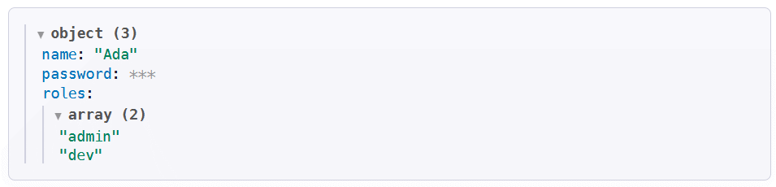
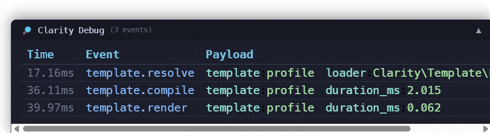

# Advanced Topics

This guide covers advanced Clarity features including template loaders, caching, auto-escaping, error handling, and Unicode support.

## Template Loaders

Clarity resolves template names through a pluggable loader system. The default `FileLoader` handles straightforward file-based resolution. Two additional loaders cover more advanced scenarios.

### Namespaces

Use `addNamespace()` to map a short alias to a template directory. Reference
templates with `namespace::path`.

```php
// Register namespaces individually
$engine
    ->addNamespace('admin',      __DIR__ . '/views/admin')
    ->addNamespace('emails',     __DIR__ . '/views/emails')
    ->addNamespace('components', __DIR__ . '/views/components');

// Or pass them all at once in the constructor
$engine = new ClarityEngine([
    'viewPath'   => __DIR__ . '/views',
    'namespaces' => [
        'admin'      => __DIR__ . '/views/admin',
        'emails'     => __DIR__ . '/views/emails',
        'components' => __DIR__ . '/views/components',
    ],
]);
```

Use the namespace prefix inside templates:

```twig


{{ include("components::card", { title: item:title }) }}
{# Unprefixed names resolve against the base viewPath: #}

```

`addNamespace()` sets up a **`DomainRouterLoader`** with the base `viewPath` as the fallback, so unprefixed template names continue to work.

To inspect registered namespaces at runtime:

```php
$map = $engine->getNamespaces(); // ['admin' => '/path/to/views/admin', ...]
```

### DomainRouterLoader

`DomainRouterLoader` dispatches template resolution based on a `domain::localName` prefix. Namespaces use this mechanism under the hood, mapping each namespace to a corresponding domain.

```php
use Clarity\Template\DomainRouterLoader;
use Clarity\Template\FileLoader;

$engine->setLoader(new DomainRouterLoader(
    [
        'admin'      => new FileLoader(__DIR__ . '/views/admin'),
        'emails'     => new FileLoader(__DIR__ . '/views/emails'),
        'components' => new FileLoader(__DIR__ . '/views/components'),
    ],
    fallback: new FileLoader(__DIR__ . '/views'),  // handles names without a prefix
));
```

Templates are referenced using the `domain::path` syntax:

```twig


{{ include("emails::welcome", { userName: user:name }) }}
```

Dots and slashes are interchangeable as path separators within the local name:

```twig


{# Both are equivalent #}
```

If no `::` prefix is present and a fallback loader is configured, the name is passed to the fallback unchanged.

#### Example Structure

```
views/
├── layouts/
│   └── main.clarity.html           (fallback)
├── pages/
│   ├── home.clarity.html           (fallback)
│   ├── about.clarity.html          (fallback)
│   └── users/
│       └── list.clarity.html       (fallback)
├── admin/                          (domain: admin)
│   ├── layouts/
│   │   └── admin.clarity.html
│   └── pages/
│       └── users.clarity.html
├── components/                     (domain: components)
│   ├── buttons/
│   │   └── primary.clarity.html
│   └── cards/
│       └── user-card.clarity.html
└── emails/                         (domain: emails)
    └── welcome.clarity.html
```

### CompositeLoader

`CompositeLoader` chains multiple loaders and returns the first successful result. It is useful for overlaying a dynamic source (e.g. database or array) on top of a file-based one:

```php
use Clarity\Template\CompositeLoader;
use Clarity\Template\ArrayLoader;
use Clarity\Template\FileLoader;

$engine->setLoader(new CompositeLoader(
    new ArrayLoader(['promo' => '<p>{{ offer }}</p>']),  // checked first
    new FileLoader(__DIR__ . '/views'),                   // fallback
));
```

The loaders are tried in the order they are passed to the constructor. The first loader that returns a successful result wins.

### setExtension() and Loaders

When `setExtension()` is called on the engine it automatically propagates to all `FileLoader` instances inside any composite or domain-router loader:

```php
$engine->setExtension('.tpl.html');  // applies to every nested FileLoader
```

## Caching

Clarity compiles `.clarity.html` templates into PHP classes and caches them on disk.

### How Caching Works

1. **First render:** the template is compiled to PHP and written to the cache directory
2. **Subsequent renders:** the cached file is loaded directly (one `require`, accelerated by OPcache)

### Compiler Version

Each compiled class records the compiler version. The loader
recompiles cached files when their version is stale or missing.

The compiled class also records the debug-mode flag and a digest of the [policy](09-policy-api.md#a-policy-change-invalidates-the-compiled-cache) it was built under; a change to either recompiles the template.

### Cache Configuration

```php
$engine->setCachePath(__DIR__ . '/cache/clarity'); // must be writable by the web server
$cachePath = $engine->getCachePath();              // default: sys_get_temp_dir() . '/clarity'

$engine->flushCache(); // delete all cached files
```

### Cache Directory Structure

Cached files are organized by hash:

```
cache/clarity/
├── a1/a1b2c3d4e5f6...php  (compiled: views/home.clarity.html)
├── b1/b2c3d4e5f6a1...php  (compiled: layouts/main.clarity.html)
└── ...
```

File names are deterministic hashes of the template path.

## Auto-Escaping

Clarity automatically escapes all output for security by default.

### How Auto-Escaping Works

Expressions are wrapped with `htmlspecialchars()` to prevent XSS attacks:

```twig
{{ userInput }}
<!-- If userInput = "<script>alert('XSS')</script>" -->
<!-- Output: &lt;script&gt;alert('XSS')&lt;/script&gt; — safe, displayed as text -->
```

```php
htmlspecialchars($vars['userInput'], ENT_QUOTES | ENT_SUBSTITUTE, 'UTF-8')
```

### Disabling Auto-Escaping (raw filter)

To output raw HTML, use the `raw` filter. It is a **compile-time marker** that disables the auto-escape wrapper, and it applies to the **entire expression** when it appears anywhere in the filter chain:

```twig
{{ article:sanitizedBody |> raw }}          {# sanitized HTML from a WYSIWYG editor #}
{{ renderedWidget |> raw }}                 {# pre-rendered HTML from your application #}
{{ data |> json |> raw }}                   {# JSON output #}
{{ description |> nl2br |> raw }}           {# HTML-generating filters like nl2br #}
{{ description |> trim |> nl2br |> raw }}   {# raw anywhere disables escaping for the whole chain #}
```

Only use `raw` with trusted content — never with user input.

### Safe HTML Generation

If you need to generate HTML in a filter, escape the dynamic content internally so the returned HTML is safe:

```php
$engine->addFilter('badge', function($value, string $type = 'default') {
    $safeValue = htmlspecialchars($value, ENT_QUOTES | ENT_SUBSTITUTE, 'UTF-8');
    return "<span class=\"badge badge-$type\">$safeValue</span>";
});
```

```twig
{{ status |> badge('success') |> raw }}
```

## Error Handling

Clarity provides detailed error messages with template file and line mapping.

### ClarityException

All template errors throw `Clarity\ClarityException`:

```php
use Clarity\ClarityException;

try {
    $output = $engine->render('page', $data);
} catch (ClarityException $e) {
    echo "Template error: " . $e->getMessage();
    echo "\nTemplate: " . $e->templateName;   // logical: "pages/home"
    echo "\nPath:     " . $e->templatePath;   // physical, or "" for a non-file loader
    echo "\nLine:     " . $e->templateLine;
}
```

`templateName` is the requested name (for example, `pages/home`), and
`templatePath` is the resolved file path. It is empty for loaders without a
filesystem path. Custom loaders can return a path in `TemplateSource`.

`ClarityException` exposes the template location through `templateName` and
`templateLine`, and mirrors it to `getFile()` and `getLine()`. This lets uncaught
errors point to the template source:
>
> ```
> Fatal error: Uncaught Clarity\ClarityException: '' is not allowed by this policy.  
> Grant the 'rawPhp' rule to allow it. in pages/home on line 4 in
> /srv/app/views/pages/home.clarity.html on line 4
> ```
>
> `getFile()` prefers the physical path, then the logical name, and falls back
> to the engine frame if no template location is available. The exception
> message keeps the logical name, and `getTrace()` retains the PHP call stack.

The original throwable is available as `$e->getPrevious()`.

### What gets mapped

| Failure                                                                | Result                                                                                                                           |
| ---------------------------------------------------------------------- | -------------------------------------------------------------------------------------------------------------------------------- |
| Undefined variable / array key / null offset                           | `ClarityException` — the render is aborted                                                                                       |
| Syntax error in a template expression                                  | `ClarityException` wrapping the `ParseError`, pointing at the template line                                                      |
| Exception thrown by a filter, function, or inline-filter PHP           | `ClarityException` wrapping the original, pointing at the template line that invoked it                                          |
| `TypeError` / `Error` (e.g. a typed filter argument rejects the value) | `ClarityException` wrapping the original, pointing at the template line                                                          |
| Other PHP diagnostics (e.g. `foreach()` over `null`, or a deprecation) | Handed to your own error handler, annotated `… in <template>:<line>`; **rendering continues** and the partial output is returned |
| Exception raised entirely outside the render path                      | Passed through unchanged, keeping its original type                                                                              |

### Interoperating with your own error handler

Clarity installs an error handler for the duration of a render and **chains** to whatever
handler was already installed, so your logging / error-reporting listener keeps working:

```php
set_error_handler(function (int $no, string $msg, string $file, int $line): bool {
    $log->warning($msg, ['file' => $file, 'line' => $line]);
    return true;
});

// Diagnostics raised inside a template arrive here annotated with the template
// location, e.g. "foreach() argument must be of type array|object, null given
// in pages/list on line 4".  $file and $line are the TEMPLATE's file and line.
$engine->render('pages/list', $data);
```

These details have three implications:

- **Clarity does not set a severity policy.** Forwarded diagnostics can be logged, ignored, or converted to exceptions by the configured handler. Clarity itself does not log, suppress, or throw them. If the handler converts warnings to exceptions, a template warning will stop the render.
- **The `E_USER_*` level is a translation, not a 1:1 mapping.** A handler invoked from PHP's own
  machinery may receive only a user-level constant, while the level still indicates the diagnostic
  *kind*: a notice arrives as `E_USER_NOTICE`, a deprecation as `E_USER_DEPRECATED`, and a native
  `E_WARNING` such as an undefined variable arrives as `E_USER_WARNING`. A handler that converts
  warnings to exceptions will not stop the render for a notice.
- **Diagnostics raised outside the template** are passed to the handler without template-location
  annotations.

### Error Messages

Clarity maps errors back to the **original template file and line**, even though the error occurs in compiled PHP:

```
Syntax error in template: unexpected token '}' in views/products/show.clarity.html on line 42
```

For a catalogue of common errors and their fixes, see the [Troubleshooting Guide](06-troubleshooting.md).

## Unicode Support

Clarity is fully Unicode-aware via the `mbstring` extension.

### Built-in Unicode Support

String filters use multibyte functions:

```twig
{{ "Ä Ö Ü ß" |> upper }} {# Output: "Ä Ö Ü SS" (Unicode-aware) #}
{{ "ПРИВЕТМИР" |> lower }} {# Output: "привет мир" #}
{{ "你好世界" |> length }} {# Output: 4 (characters, not bytes) #}
```

### Emoji Support

Clarity handles emoji correctly:

```twig
{{ "Hello 👋 World 🌍" |> length }} {# Output: 13 (counts emoji as 1 character each) #}
{{ "🚀🌟💡" |> reverse }} {# Output: "💡🌟🚀" #}
```

### Character Encoding

Clarity assumes **UTF-8** encoding:

- All templates should be saved as UTF-8
- Input data should be UTF-8
- Output is UTF-8

If working with other encodings:

```php
// Convert to UTF-8 before rendering
$data['text'] = mb_convert_encoding($data['text'], 'UTF-8', 'ISO-8859-1');

$engine->render('page', $data);
```

## Security Model

The policy determines which constructs templates may use. The engine uses
`Policy::restricted()` by default. Checks run during compilation; see
[The Policy API](09-policy-api.md) for presets and grants.

### Compile-Time Restrictions

Under the default policy, the following are rejected at compile time (the template won't compile):

```twig
{{ strtoupper(name) }}                 {# ERROR: unregistered function calls #}
{{ file_get_contents('/etc/passwd') }} {# ERROR #}
{{ user.getName() }}                   {# ERROR: method calls #}
{{ `ls -la` }}                         {# ERROR: backticks, heredocs, PHP tags #}
{{ new DateTime() }}                   {# ERROR: needs the 'newExpressions' rule #}
{{ Foo::create() }}                    {# ERROR: needs the 'staticCalls' rule #}
{{ Foo\Bar }}                          {# ERROR: a class name is not a value #}
```

### Object and Value Handling

`render()` passes scope values to the template as-is; it does not convert objects to arrays or other template-specific values. `a.b` reads an object property, while `a:b` reads an array key. PHP visibility rules apply:

```php
class User {
    public $name = 'John';
    private $password = 'secret';
}

$user = new User();
$engine->render('page', ['user' => $user]);
```

```twig
{{ user.name }}       {# 'John' — real property read #}
{{ user:name }}       {# ERROR: a key read on an object #}
{{ user.getName() }}  {# COMPILE ERROR: method calls not allowed #}
```

```php
class User {
    public string $name = 'Jane';
    private string $secret = 'hidden';
}
```

```twig

    [{{ key }}={{ value }}]

{# [name=Jane] — iteration includes public properties only #}
```

`Traversable` objects are iterated as containers. A value object with no public
properties that implements `Stringable` retains its string form, so `length` of
a `Money` object counts the characters returned by `__toString()`. A
`DateTimeInterface` value remains an object for the `date` filter; scalars and
`null` pass through unchanged.

### Lambda Security

Lambdas in `map`, `filter`, `reduce` only accept:

1. **Lambda expressions** (parsed at compile time)
2. **Filter references** (validated at compile time)

**Example:**

```twig
{{ items |> map(i => i:name) }} {# Lambda: safe #}
{{ items |> map("upper") }}     {# Filter reference: safe #}
```

### Registered Filters/Functions

Only **registered** filters and functions are callable under the default policy:

```php
$engine->addFilter('customFilter', $callable);
```

```twig
{{ value |> customFilter }} {# Allowed: registered #}
{{ value |> notRegistered }} {# ERROR: not registered #}
```

A policy can also allow PHP functions to be called **by their own name**, without
registering them. Granting a name turns the `phpFunctions` rule on as it grants, so
one call is enough — and because the allowlist is non-empty, only the names you
list resolve:

```php
use Clarity\Engine\Policy;

$engine->setPolicy(Policy::default()->allowFunctions('strtoupper', 'count'));
```

### Policies

A policy answers one question: _what is this template allowed to reach?_ It is a set of rules plus two allowlists, and the default is sandboxed:

```php
use Clarity\Engine\Policy;

$engine->setPolicy(Policy::restricted());    // the default
$engine->setPolicy(Policy::trusted());       // PHP function calls, method calls, superglobals, PHP locals
$engine->setPolicy(Policy::unrestricted());  // every rule
$engine->setPolicy(
    Policy::default()
        ->allowFunctions('strtoupper', 'count')
);
```

Rules expose different levels of access, and each names one construct.  

PHP function calls in template expressions need the `phpFunctions` rule — granted on its own, or automatically by `allowFunctions()`.

Raw `` blocks need the separate `rawPhp` rule.  

`Policy::unrestricted()` allows every rule, so use it only for templates written and reviewed by trusted authors.

Use `denyFunctions()` to reject named PHP functions in template expressions, when
the policy otherwise allows them:

```php
$engine->setPolicy(
    Policy::trusted()
        ->denyFunctions('exec', 'system', 'proc_open')
);
```

It does not inspect calls inside raw `` blocks; those are emitted as PHP
and are governed by `rawPhp` alone.

Two details apply across policies:

- **Clarity reserves `__c_` names for its own bindings.** Template-level variable bindings cannot shadow them; dynamic-variable reads resolve against the render scope and loop locals.
- **Superglobals require a separate grant.** Without it, `{{ _SERVER }}` is a scope read and throws if that name is absent, even when `phpVariables` is enabled.

See [The Policy API](09-policy-api.md) for the rule and allowlist
reference.

## Performance Optimization

### Pre-Compilation

Pre-compile all templates after deployment:

```php
$templates = [
    'layouts/main',
    'pages/home',
    'pages/about',
    // ... all templates
];

foreach ($templates as $template) {
    $engine->render($template, []);
}
```

This warms the cache and ensures the first user request is fast.

### Cache in Persistent Storage

Use a persistent cache directory (not `/tmp`):

```php
$engine->setCachePath('/var/cache/clarity');
```

Ensure it survives server restarts.

### OPcache Configuration

Enable OPcache in production (`php.ini`):

```ini
opcache.enable=1
opcache.memory_consumption=128
opcache.interned_strings_buffer=8
opcache.max_accelerated_files=10000
opcache.revalidate_freq=2
```

### Minimize Template Complexity

- Keep logic simple (complex logic in PHP, not templates)
- Avoid deeply nested loops
- Cache computed values in PHP before passing to template

## Configuration Reference

### Configuration Methods

| Method                                      | Description                                        |
| ------------------------------------------- | -------------------------------------------------- |
| `setViewPath(string $path)`                 | Base directory for templates                       |
| `setLayout(?string $layout)`                | Default layout template                            |
| `setExtension(string $ext)`                 | File extension (default: `.clarity.html`)          |
| `setCachePath(string $path)`                | Cache directory                                    |
| `getCachePath(): string`                    | Get current cache path                             |
| `setPolicy(Policy\|array $policy)`          | What templates may reach (default: sandboxed)      |
| `getPolicy(): Policy`                       | The current policy                                 |
| `isSandboxed(): bool`                       | Whether the policy lets templates reach PHP at all |
| `flushCache(): void`                        | Delete all cached files                            |
| `addFilter(string $name, callable $fn)`     | Register custom filter                             |
| `addFunction(string $name, callable $fn)`   | Register custom function                           |
| `setLoader(TemplateLoader $loader)`         | Set custom template loader                         |
| `render(string $view, array $vars): string` | Render template and return HTML                    |

### Example: Complete Setup

```php
use Clarity\ClarityEngine;

$engine = new ClarityEngine();

// Paths
$engine->setViewPath(__DIR__ . '/views');
$engine->setCachePath(__DIR__ . '/cache/clarity');

// Default layout
$engine->setLayout('layouts/main');

// Domain-based loader (admin:: and emails:: prefixes, plus fallback)
$engine->setLoader(new \Clarity\Template\DomainRouterLoader(
    [
        'admin'  => new \Clarity\Template\FileLoader(__DIR__ . '/views/admin'),
        'emails' => new \Clarity\Template\FileLoader(__DIR__ . '/views/emails'),
    ],
    fallback: new \Clarity\Template\FileLoader(__DIR__ . '/views'),
));

// Custom filters
$engine->addFilter('currency', fn($v) => '€ ' . number_format($v, 2));
$engine->addFilter('excerpt', fn($text, $len = 100) =>
    mb_strlen($text) > $len ? mb_substr($text, 0, $len) . '...' : $text
);

// Custom functions
$engine->addFunction('asset', fn($path) => '/assets/' . ltrim($path, '/'));

// Render
echo $engine->render('pages/home', [
    'title' => 'Home',
    'user' => $user,
]);
```

## Modules

Modules are the recommended way to bundle related filters, functions, block directives, and services into a single reusable unit:

```php
use Clarity\Localization\IntlFormatModule;
use Clarity\Localization\TranslationModule;

$engine->use(new IntlFormatModule(['locale' => 'de_DE', 'timezone' => 'Europe/Berlin']));
$engine->use(new TranslationModule([
    'locale'            => 'de_DE',
    'fallback_locale'   => 'en_US',
    'translations_path' => __DIR__ . '/locales',
]));
```

The built-in localization modules provide:

- **`IntlFormatModule`** — locale-aware number, currency, date and text filters backed by PHP's `intl` extension: `format_number`, `format_currency`, `percent`, `spellout`, `ordinal`, `format_date`, `format_relative`, `country_name`, `format_message`, …
- **`TranslationModule`** — a `t` filter for lookup in domain-separated locale files (PHP, JSON, YAML) plus the `` block for domain switching
- **`LocaleService`** — a push/pop locale stack with the `` block (auto-bootstrapped by the other two modules)

Custom modules implement `Clarity\ModuleInterface` with a single `register(ClarityEngine $engine): void` method.

**[Full module reference →](07-modules.md)**

## Debug Mode

Use `setDebugMode()` to control debug mode.

```php
$engine->setDebugMode(true);                              // full debug, defaults
$engine->setDebugMode(new DumpOptions(maxDepth: 3));      // …with options
$engine->setDebugMode(false);                             // production
```

When active:

- **`dump()` is rendered context-aware**
    - an HTML tree in HTML
    - a JavaScript `;/* DEBUG_DUMP: … */` comment inside `<script>`
    - a CSS `/* DEBUG_DUMP: … */` comment inside `<style>`
    - with the keys listed in
      `DumpOptions::$maskKeys` masked (`password`, `token`, `secret`, …).
- **`{{ x |> dump }}`** dumps the piped value at the pipe position and still
  yields it, so `{{ items |> dump |> length }}` measures `items`.
- **`{{ map(items, "dump") }}`** works as a callable reference too.
- **Range-loop safety checks** run at runtime: a step of `0`, or a step moving
  away from the end (which would loop forever), throws a `RuntimeException`.
- A **`DebugEventBus`** reports template resolution, compilation, cache hits
  and rendering; see below for event details and subscriptions.

```php
// Check whether debug mode is currently on
$engine->isDebugMode(); // bool
```

### Debug events

`getDebugBus()` returns the active bus (or `null` when debug mode is off).
Subscribe either a callable or a `DebugListener`; listeners run synchronously
when an event is emitted. Every event is also retained in `getEvents()` until
the bus is discarded. A `DebugEvent` has a `type`, a metadata `payload`, and a
Unix timestamp:

| Event              | Payload                                           |
| ------------------ | ------------------------------------------------- |
| `template.resolve` | `template`, `loader` class                        |
| `template.compile` | `template`, `duration_ms`                         |
| `template.cached`  | `template` (compiled template served from cache)  |
| `template.render`  | `template`, `duration_ms`                         |

The bus reports template lifecycle metadata, not template variables or dump
values. `new DumpOptions(showPanel: true)` automatically subscribes the
floating HTML panel to the same events and appends it to the rendered output.

### Dump renderers

For ordinary `dump()` calls, the template's output context selects the renderer;
running PHP from the CLI does not by itself switch a template dump to the CLI
format.

| Renderer | Output |
| -------- | ------ |
| HTML | A collapsible `<details>` tree, with escaped scalar text and inline CSS injected on the first HTML dump in the process. |
| JavaScript | JSON inside a `;/* DEBUG_DUMP: … */` comment, safe to place between script statements; closing `*/` sequences in values are escaped. |
| CSS | JSON inside a `/* DEBUG_DUMP: … */` comment; closing `*/` is escaped and tag delimiters are JSON-hex-encoded to protect the surrounding `<style>` element. |
| CLI | A nested text tree, ANSI-colored when writing to a terminal and plain otherwise. `dd()` uses this renderer under CLI/phpdbg, writes to standard output, and exits; `CliDumpRenderer::render()` writes to standard error by default, or returns the string when `forceToTemplate` is enabled. |

HTML and CLI output truncate nested values at `maxDepth` and limit each array
to `maxItems`. JavaScript output also truncates at `maxDepth`, but serializes
all array items. CSS comments also truncate at `maxDepth` and serialize all
array items. Matching `maskKeys` are case-insensitive string keys in arrays;
this is not general redaction for arbitrary object properties.

Everything debug is **compile-time or zero-cost in production**: `dump()` is
pruned to `''` — including the filter and reference forms, which collapse to the
identity — so a debug chain left in a template costs nothing and prints nothing.

> **Tip:** Enable debug mode in development and disable it in production to keep
> generated code lean. `dd()` is an exception: it is never pruned, so with
> debug off it throws rather than dumping raw, unmasked values.

Debug dump example:



Debug panel example:



## Inline Filters

Inline filters are compiled **directly into the generated PHP expression** — no callable is invoked at runtime, making them zero-overhead alternatives to regular filters.

### Registering an Inline Filter

```php
$engine->addInlineFilter('dollars', [
    'php'     => '\number_format({1}, 2, ".", ",") . " USD"',
]);
```

### With Parameters

```php
$engine->addInlineFilter('pad', [
    'php'      => '\str_pad({1}, {2}, {3}, \STR_PAD_LEFT)',
    'params'   => ['length', 'char'],
    'defaults' => ['char' => "' '"],
]);
```

The template:

```twig
{{ invoiceNumber |> pad(8, '0') }}
```

Compiles to: `\str_pad($vars['invoiceNumber'], 8, '0', \STR_PAD_LEFT)` — no function lookup at runtime.

### Template Syntax

| Placeholder | Meaning                           |
| ----------- | --------------------------------- |
| `{1}`       | The piped value                   |
| `{2}`       | First additional parameter        |
| `{3}`       | Second additional parameter, etc. |

## Custom Directives

Directives extend the template compiler with custom `` tags. They are compiled at build time and emit raw PHP code.

### Registering Directives

```php
$cache = new class {
    private array $keyStack = [];
    private array $items = [];

    public function pushKey(string $key): void
    {
        $this->keyStack[] = $key;
    }

    public function currentKey(): string
    {
        if ($this->keyStack === []) {
            throw new \LogicException('No active cache key.');
        }

        return $this->keyStack[array_key_last($this->keyStack)];
    }

    public function popKey(): void
    {
        if ($this->keyStack === []) {
            throw new \LogicException('No active cache key to pop.');
        }

        array_pop($this->keyStack);
    }

    public function has(): bool
    {
        return array_key_exists($this->currentKey(), $this->items);
    }

    public function get(): string
    {
        return $this->items[$this->currentKey()];
    }

    public function set(string $value): void
    {
        $this->items[$this->currentKey()] = $value;
    }

};

// Register the cache service with the engine.
// Directives can access the cache service via $this->services['cache'] or local render-frame variable $__c_sv['cache'].
$engine->addService('cache', $cache);

$engine->addDirective('cache', function(string $rest, TemplateLocation $at, callable $processExpr): string {
    $param = $processExpr(trim($rest));
    return <<<PHP
        \$this->services['cache']->pushKey({$param});
        try {
            if (\$this->services['cache']->has()) {
                echo \$this->services['cache']->get();
            } else {
                ob_start();
    PHP;
}, ['endcache' => 'required']);

$engine->addDirective('endcache', function(string $rest, TemplateLocation $at, callable $expr): string {
    return <<<PHP
                \$__cached = ob_get_clean();
                \$this->services['cache']->set(\$__cached);
                echo \$__cached;
            }
        } finally {
            \$this->services['cache']->popKey();
        }
    PHP;
}, ['cache' => 'owner']);
```

The service is registered under `cache`, matching the `$this->services['cache']` lookups emitted by the directives. The cache hit check happens before the template block, so the block is skipped entirely on a hit. The `try/finally` always pops the active key, including when rendering the block throws, and the service-owned stack supports nested cache blocks. The in-memory example keeps values only while this service instance lives; use a persistent cache implementation with the same `has()`, `get()`, `set()`, `pushKey()`, `currentKey()`, and `popKey()` methods to share cached values across requests.

Example usage:

```twig

    <h2>{{ featuredTitle }}</h2>
    <h3>{{ "now" |> date("Y-m-d H:i:s") }}</h3>

```

The `$processExpr` callable converts the cache-key expression (a variable or literal) to a PHP expression string.

### Paired Directives

A directive that wraps a body — anything with an `` counterpart — should
declare its members on the opening tag. The declaration is a `keyword => role` map:

| Role | Where | Meaning |
| ---- | ----- | ------- |
| `'required'` | opener | The closing tag. Exactly one per construct. |
| `'allowed'` | opener | An optional branch tag, usable at most once between open and close. |
| `'owner'` | member | Assertion that this tag belongs to the named opener (checked; changes nothing else). |

```php
$engine->addDirective('cache', $openHandler, [
    'endcache'  => 'required',   // the closing tag
    'cacheelse' => 'allowed',    // optional branch tag
]);

$engine->addDirective('endcache',  $closeHandler);                       // no metadata needed
$engine->addDirective('cacheelse', $branchHandler, ['cache' => 'owner']); // …or assert the owner
```

The opener's declaration is the single source of truth; a member's `'owner'` entry only
asserts agreement with it, catching the "registered the close but forgot the opener"
mistake at the start of every compile.

Once declared, the compiler rejects — with the template name and line — an unclosed
`` (`Unclosed '' tag (opened on line 3): add ''`), a
stray ``, a close that crosses a nested ``/`` or another
construct, a branch tag used outside its construct, and a construct that spans an
``. Directives registered WITHOUT a pairing keep behaving exactly as before,
so this is opt-in per construct.

### Handler Signature

```php
function (
    string           $rest,        // text after the keyword inside 
    TemplateLocation $at,          // where the tag sits: name, line and file
    callable         $processExpr  // Clarity expression(s) → PHP expression(s)
): string                          // must return PHP statement(s) to emit
```

`$at` is a [`Clarity\Template\TemplateLocation`](../src/Template/TemplateLocation.php) carrying the
logical template name, the line, and — when the active loader is file-backed — the physical
file. It exists so a handler can raise a **complete** `ClarityException` on its own, without
the engine having to fill in anything afterwards:

```php
$engine->addDirective('cache', function (string $rest, TemplateLocation $at, callable $processExpr): string {
    if (trim($rest) === '') {
        throw new ClarityException('cache needs a key', $at);
    }
    return "\$this->services['cache']->begin({$processExpr(trim($rest))});";
}, ['endcache' => 'required']);
```

Passing `$at` straight to the second parameter is all it takes. A bare
`throw new ClarityException('cache needs a key')` is still located against the template,
but only because the compiler discovers where it was thrown — handing `$at` through keeps
the exception complete at the point it was raised, which is also what keeps it from being
wrapped a second time. `$at->path` is `''` for a loader with no file to name
(`ArrayLoader`, `StringLoader`, a database loader), exactly as in `ClarityException`.

### Directive Arguments

`$processExpr($rest)` compiles **one** Clarity expression to PHP. When a tag takes a
list — `` — call it with
`$asList = true` and it compiles the whole list instead, using the same grammar and
rules the filter syntax uses:

```
[name: ] expr [, [name: ] expr ...]
```

It returns `[positional, named]`, both lists of compiled PHP expressions, keyed by numeric
index and by name:

```php
$engine->addDirective('cache', function (string $rest, TemplateLocation $at, callable $processExpr): string {
    [$positional, $named] = $processExpr($rest, true);

    $key  = $positional[0] ?? null;   // "user_" ~ id  → the first unnamed argument
    $ttl  = $named['ttl']  ?? '300';  // ttl: 300
    $tags = $named['tags'] ?? '[]';   // tags: ["user"]

    return "\$this->services['cache']->begin({$key}, {$ttl}, {$tags});";
}, ['endcache' => 'required']);
```

An argument whose text starts with `name:` is **named**; anything else is **positional**
and takes the next numeric index. A positional argument may not follow a named one, a
name may not repeat, and an empty argument (`a,,b`) is rejected — all at compile time,
naming the template and line. A quoted `"a,b"`, a `{a: 1, b: 2}` literal, or a nested
`fn(x, y)` never splits. `$processExpr($rest)` (no second argument) is unchanged, so
existing handlers need no edit.

Failure inside the handler is located too: `throw new ClarityException('…', $at)` is reported
against the template, its line, and — when the loader is file-backed — the physical file,
rather than the closure that threw. A bare `throw new ClarityException('…')` is located the
same way; passing `$at` simply means the exception is already complete when thrown.

### The `__c_` prefix

The engine reserves the `__c_` prefix for its own internal variables. Therefore, template authors **cannot** bind a `__c_`-prefixed name.

## Services

Services are arbitrary objects registered into the engine and made available inside compiled templates via `$this->services['key']` (or the `$__c_sv['key']` render-frame local — see below). They're primarily used by modules to share mutable state (e.g. a locale stack or cache object) between registered filters/directives and inline filter PHP templates.

### Registering a Service

```php
$myService = new MyStatefulService();

$engine->addService('my_service', $myService);
```

### Checking and Retrieving Services

```php
if ($engine->hasService('my_service')) {
    $svc = $engine->getService('my_service');
}
```

### Accessing Services in Inline Filters

Inline filter PHP templates can reference services via `$__c_sv['key']`:

```php
$engine->addInlineFilter('t', [
    'php'     => "\$__c_sv['translator']->get(\$__c_sv['locale']->current(), {1})",
    'params'  => ['vars'],
    'defaults'=> ['vars' => 'null'],
]);
```

`$__c_sv` is the render-frame local. Use it in an inline filter because an inline
filter may also be referenced as a quoted name, which wraps it in a `static` closure;
there `$this->services` is unreachable and `$__c_sv` is not. See
[$__c_sv and $this->services](#__c_sv-and-this-services--two-spellings-one-table) below.

> **Note:** Services are infrastructure for module authors: an application that only registers filters and functions does not need them.

### `$__c_sv` and `$this->services` — Two Spellings, One Table

The services table is passed to the compiled class's constructor as `$services`, and
the callables table as `$functions`:

```php
public function __construct(private array $functions, private array $services) {}
```

`render()` unpacks each into a local **only when the compiled body actually uses it**,
so a template that touches neither pays nothing:

```php
public function render(array $__c_va): string
{
    $__c_sv = $this->services;   // emitted only when the body needs it
    // …
}
```

Both spellings reach the same table, and which one to use is decided by where the
generated code ends up:

| Emitted code position | `$this->services[…]` | `$__c_sv[…]` |
| --------------------- | -------------------- | ------------ |
| Directive body, inline filter in the direct pipe position | ✅ | ✅ |
| Inside an emitted `static fn` — lambda body, quoted filter reference | ❌ | ✅ |

Lambda bodies and quoted filter references compile to **`static` closures**, where
`$this` is unbound. Inside one, `$__c_sv` / `$__c_fn` is the only reachable form —
which is exactly why the locals exist and why the properties could not simply be
inlined at every use. A service lookup emitted inside a closure must therefore use
`$__c_sv`, and the emitted `use (…)` clause is what binds it:

```php
// {{ map(items, "quoted_inline_filter") }}
static fn(mixed $__c_val): mixed => $__c_sv['svc'](($__c_val))
```

For a directive handler that only ever emits into `render()`, `$this->services['key']`
is the readable choice. For an inline filter that may also be referenced as a quoted
name, `$__c_sv['key']` is the safe one. `$__c_fn` is the counterpart for the callables
table, and like services it is only unpacked when the body references it.

> **Renamed in 0.3.0.** The constructor properties were `__c_fn` / `__c_sv` before;
> they are now `functions` / `services`. The emitted locals keep the `__c_` prefix,
> because a `__c_`-prefixed name is reserved by the engine and can never be claimed
> by a template variable. `COMPILER_VERSION` moved 26 → 27, so cached templates are
> recompiled automatically.

## Next Steps

- **[Best Practices](05-best-practices.md)** — Organization, naming, security
- **[Troubleshooting](06-troubleshooting.md)** — Common errors and solutions
- **[Examples](examples/README.md)** — See advanced features in action
