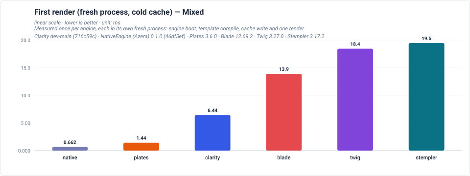
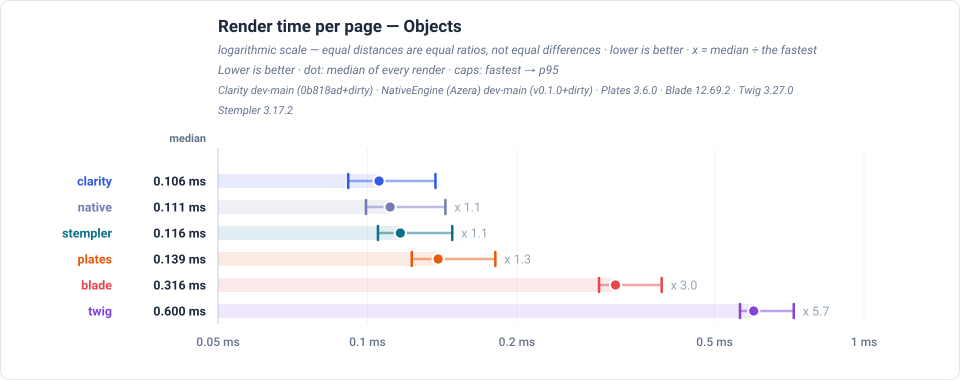
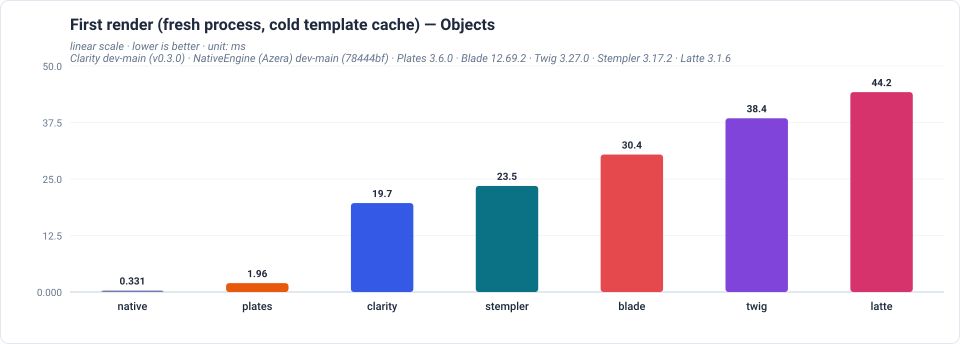
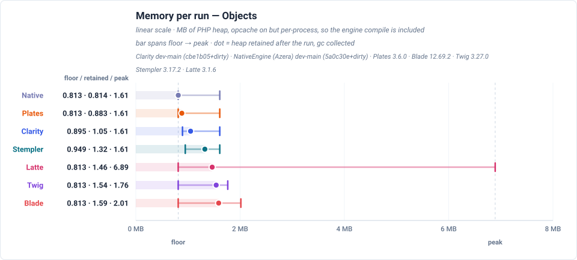

# Benchmark

How Clarity compares with the other mainstream PHP template engines, across four rendering shapes: a page of scalars, a heavy page of escapes and loops, a page of objects, and the same objects held as nested arrays. The main README shows one of these at a glance; this page is the comparison in full.

> **Generated — do not edit by hand.** Every figure below comes from a benchmark run's own JSON and is re-rendered from it, so the numbers cannot drift from the data they came from. To update this page, re-run the harness and re-publish; see the `azera-competition` repository.

<!-- view-engine:begin -->
Every engine was measured rendering the SAME template shape, on the same machine and PHP build and in the same session, so a difference between two engines is the engines and a difference between two sections is the work the page does.

Compare engines WITHIN a shape. The sections below are different templates doing different work with different data, so a time in one and a time in another are different measurements — a ranking read across sections would be a ranking of the pages, not of the engines.

## Mixed

What this page renders, and so what these numbers are the cost of: the heavy page: 20 flat variables each read twice (as text and as a data-value attribute) plus 20 rows of six fields each, over 40 flat variable accesses per render and 1440 in total at 200 items, with every value HTML-special so the escape path does real work in both the body and an attribute context.

### Time per render — Mixed

The dot is the median render and the caps bound the fastest observation and p95, so an engine that is usually fast but occasionally slow looks different from one that is uniformly slower. The multiplier beside each row is measured against the fastest median in the chart.

### First render — Mixed

The one-off cost the first request after a deploy pays: the engine's classes load, the template compiles, the cache is written and the page renders once. Measured in a fresh process per engine, so no engine is measured against a cache another engine already paid for.

### Memory per run — Mixed

Three marks, three measurements: the left cap is the engine loaded with nothing rendered, the dot is the heap retained after the run (gc collected) and the right cap is the run's peak. Not a spread of repeats — every reading is deterministic.

### Results — Mixed

Generated from the same rows the charts above are drawn from. Rows are ordered by median, fastest first.

| Engine | First render (ms) | Mean (ms) | Median (ms) | Min (ms) | p95 (ms) | Retained (MB) | Peak (MB) |
| --- | ---: | ---: | ---: | ---: | ---: | ---: | ---: |
| Clarity | 15.653 | 0.322 | 0.313 | 0.293 | 0.370 | 1.17 | 1.59 |
| Stempler | 30.288 | 0.337 | 0.326 | 0.306 | 0.388 | 1.45 | 2.00 |
| Native | 0.591 | 0.353 | 0.342 | 0.321 | 0.398 | 0.91 | 1.52 |
| Plates | 2.392 | 0.406 | 0.394 | 0.368 | 0.471 | 0.98 | 1.52 |
| Blade | 33.222 | 0.639 | 0.621 | 0.578 | 0.747 | 1.69 | 2.12 |
| Twig | 35.839 | 0.854 | 0.829 | 0.782 | 0.991 | 1.65 | 2.15 |

## Objects

What this page renders, and so what these numbers are the cost of: objects instead of scalars: two properties, a nested object, a nullable property behind a default, and an array inside an object.

### Time per render — Objects

The dot is the median render and the caps bound the fastest observation and p95, so an engine that is usually fast but occasionally slow looks different from one that is uniformly slower. The multiplier beside each row is measured against the fastest median in the chart.

### First render — Objects

The one-off cost the first request after a deploy pays: the engine's classes load, the template compiles, the cache is written and the page renders once. Measured in a fresh process per engine, so no engine is measured against a cache another engine already paid for.

### Memory per run — Objects

Three marks, three measurements: the left cap is the engine loaded with nothing rendered, the dot is the heap retained after the run (gc collected) and the right cap is the run's peak. Not a spread of repeats — every reading is deterministic.

### Results — Objects

Generated from the same rows the charts above are drawn from. Rows are ordered by median, fastest first.

| Engine | First render (ms) | Mean (ms) | Median (ms) | Min (ms) | p95 (ms) | Retained (MB) | Peak (MB) |
| --- | ---: | ---: | ---: | ---: | ---: | ---: | ---: |
| Clarity | 15.339 | 0.111 | 0.105 | 0.095 | 0.133 | 1.05 | 1.52 |
| Native | 0.417 | 0.117 | 0.111 | 0.093 | 0.140 | 0.81 | 1.52 |
| Stempler | 22.398 | 0.123 | 0.116 | 0.107 | 0.149 | 1.32 | 1.52 |
| Plates | 2.010 | 0.148 | 0.139 | 0.122 | 0.181 | 0.88 | 1.52 |
| Blade | 30.908 | 0.329 | 0.317 | 0.293 | 0.394 | 1.59 | 2.01 |
| Twig | 34.159 | 0.619 | 0.598 | 0.568 | 0.720 | 1.54 | 1.76 |

## What the columns are

- **First render** — the first request after a deploy, measured in a fresh process per engine: engine boot, template compile, cache write and one render. The TEMPLATE cache is cold; OPcache is on but its CLI segment is per-process, so the engine source is compiled in that process. Comparable across engines because no engine inherits another's warm template cache or loaded classes.
- **Mean / Median / Min / p95** — computed over every individual render across all runs.
- **Retained** — PHP heap still held after a whole run of renders, with `gc_collect_cycles()` called before the reading, in a fresh process. This is what a process carries while serving.
- **Peak** — the same run's PHP heap high-water mark, which is where the transient allocation of the first compile lives. It sits above Retained and is not a second measurement of it.

Two engines sitting next to each other at the top of a table are not thereby ranked: a difference of a few percent is still within the spread of a single engine's own runs, and a gap that small is a tie, not a win.

**Environment** — PHP 8.3.33 · Linux 6.8.0-139-generic · SAPI cli · OPcache (`opcache.enable_cli`): yes · Memory probe: `a fresh process with opcache.enable_cli=1 but a per-process CLI segment, so engine source is compiled in that process`

**Budget** — 10,000 renders × 30 runs, 200 items per render

**Method** — Steady-state timings: the render loop for each (engine, page) cell runs in its own fresh process against a warm cache: one untimed warm-up render, then runs x iterations-per-run timed renders. No order: each (engine, page) cell is measured in its own process, so measurement order cannot affect a cell. The first render was measured as one render in a fresh process with a cold template cache: engine class loading, template compile, cache write and one render.

**Engines** — Clarity dev-main (0a1c64d) · NativeEngine (Azera) dev-main (v0.1.0+dirty) · Plates 3.6.0 · Blade 12.69.2 · Twig 3.27.0 · Stempler 3.17.2

_Measured 2026-09-29T22:42:39+00:00_

Every chart on this page is a plain SVG generated from the run's own JSON, so a number and a diagram cannot disagree. The full published report, including the headline page and each shape's live page: <https://sailantis.github.io/azera-competition/benchmarks/view-engine.html>
<!-- view-engine:end -->
